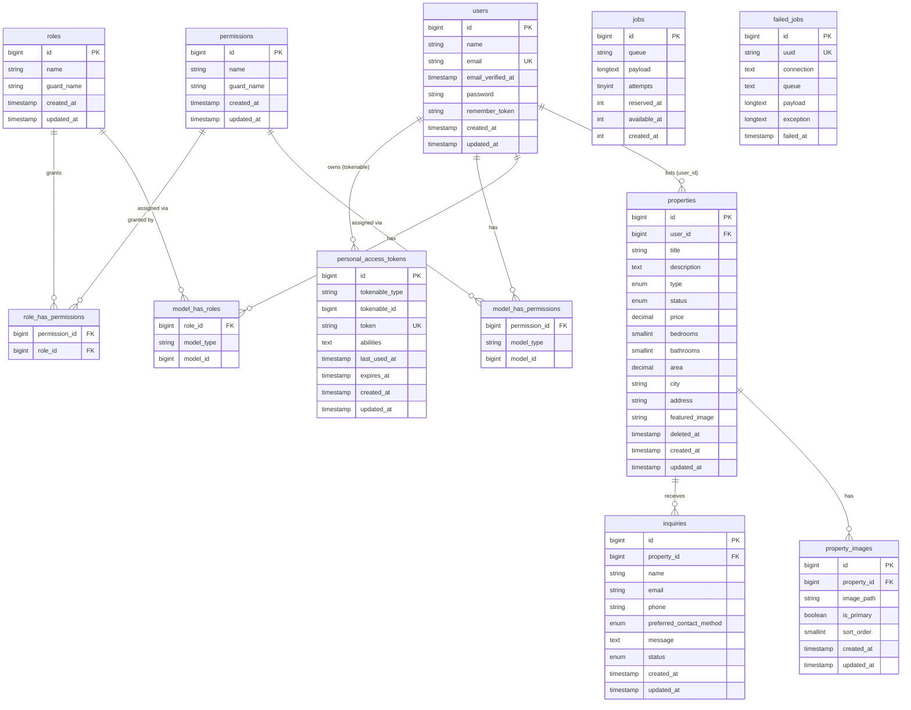

# PropTrack — Entity Relationship Diagram

Full normalized relational schema for the PropTrack database.

## Mermaid ERD

---

## Table Descriptions

### `users`
Core authentication table managed by Laravel Breeze. Every row that participates in the system as an agent or admin is linked to a row in `model_has_roles`.

**Indexes:** `email` (unique)

---

### `roles` / `permissions` / `model_has_roles` / `model_has_permissions` / `role_has_permissions`
Managed by **Spatie Laravel Permission v6**. The application uses two roles: `admin` and `agent`. Permissions are role-scoped; no per-user permissions are used.

---

### `properties`
Central listings table. Each row belongs to one agent (`user_id`). Soft-deleted via `deleted_at` so records are preserved after removal from public view.

| Column | Type | Notes |
|--------|------|-------|
| `type` | ENUM | `house`, `apartment`, `townhouse`, `land`, `commercial` |
| `status` | ENUM | `active`, `under_offer`, `sold`, `inactive` |
| `price` | decimal(12,2) | |
| `area` | decimal(10,2) | Square feet, nullable |

**Indexes:**
- `city` (individual)
- `status` (individual)
- `type` (individual)
- `(status, type, city)` composite — used by public listing filters
- `(user_id, status)` composite — used by agent-scoped management queries

---

### `property_images`
Gallery images for a listing. `is_primary` identifies the hero image. `sort_order` controls display sequence.

**Indexes:** `(property_id, sort_order)` composite

---

### `inquiries`
Submitted by anonymous visitors or authenticated users on a property's detail page. Status drives the workflow: `new` → `in_review` → `contacted` → `closed`.

| Column | Type | Notes |
|--------|------|-------|
| `preferred_contact_method` | ENUM | `Phone`, `Email`, `WhatsApp` — nullable |
| `status` | ENUM | `new`, `in_review`, `contacted`, `closed` |

**Indexes:**
- `status` (individual)
- `(property_id, status)` composite — used by agent inquiry queries

---

### `personal_access_tokens`
Laravel Sanctum tokens issued on `POST /api/auth/login`. Stored as a SHA-256 hash; the plain-text token is only returned once on creation.

---

### `jobs` / `failed_jobs`
Laravel queue tables. `SendInquiryNotificationJob` is dispatched to `jobs` after each inquiry is stored. If all 3 retries fail (e.g., SMTP unavailable), the record moves to `failed_jobs` — the inquiry itself is unaffected.
